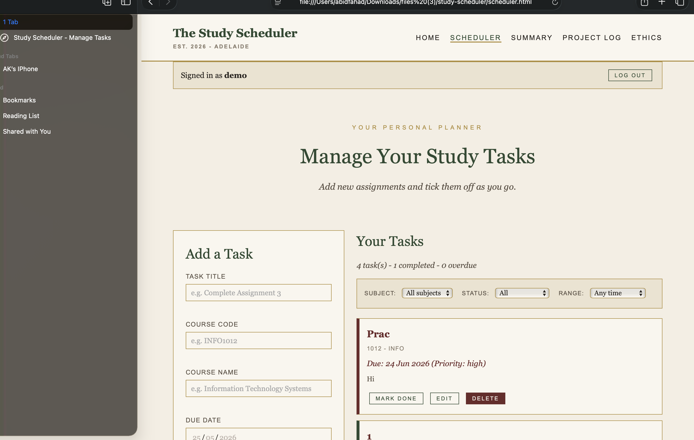

# Study Scheduler

A personal study task manager built for **INFO1012 Assignment 3**
by **Abid Fahad Khan**.

Made with plain HTML, CSS, and JavaScript - no frameworks needed.
The design uses an "old money" colour palette: cream, forest green,
burgundy, and gold.

---

## What This Project Does

The Study Scheduler helps university students keep track of their
assignments and study tasks. Users can:

- Sign up for an account or sign in with a demo account
- Add new study tasks with course code, due date, and priority
- Edit and delete existing tasks
- Mark tasks as done
- Filter tasks by subject, status, or date range
- View a summary of all their work

---

## How to Install and Run

You only need a web browser and Visual Studio Code.

### Step 1 - Get the project files

Either download the ZIP file from GitHub, or clone the repository:

```
git clone <https://github.dev/UniSA-STEM/assignment3-webpage-AbidFahadKhan>
```

### Step 2 - Open the folder in Visual Studio Code

Open VS Code, then go to **File > Open Folder** and pick the
project folder.

### Step 3 - Install the Live Server extension

You need to run this through a local web server. Without it, the
colours may not show and tasks may not save.

1. In VS Code, click the **Extensions** icon on the left (or press `Ctrl+Shift+X`)
2. Search for **Live Server** by Ritwick Dey
3. Click **Install**

### Step 4 - Run the project

Right-click on `index.html` in the file list, then choose
**Open with Live Server**.

The website will open in your browser at `http://127.0.0.1:5500`.

---

## How to Use the Website

### Sign in

When you open the website, click **Enter the Scheduler** on the
home page. You can sign in with:

- **Username:** `demo`
- **Password:** `study2025`

Or click **Create one** to make your own account.

### Add a task

1. Go to the Scheduler page
2. Fill in the form on the left with task title, course code,
   course name, due date, priority, description, and notes
3. Click **Add Task**

Your task appears in the list on the right.

### Edit or delete a task

- Click **Edit** on any task to change its details
- Click **Delete** to remove it (a popup asks you to confirm)
- Click **Mark Done** to tick it off (or **Undo** to bring it back)

### Filter tasks

Use the dropdowns at the top of the task list to filter by
subject, status, or date range.

### Other pages

- **Home** - introduction and image gallery
- **Summary** - filtered view of tasks across time periods
- **Project Log** - my Agile sprint plan and bug fixes during development
- **Ethics** - my reflection on privacy and ethical design

---

## Screenshot

The main scheduler page with the task form on the left and the
task list on the right:




---

## Project Files

```
Assignment_3_WebPage/
├── index.html        Home page
├── login.html        Sign-in and sign-up
├── scheduler.html    Add and manage tasks
├── summary.html      Filtered task view
├── blog.html         Project plan and bug log
├── ethics.html       Ethics and privacy reflection
├── css/
│   └── styles.css    All the styling
├── js/
│   └── script.js     All the JavaScript
├── assets/           For screenshots
├── README.md         This file
└── LICENSE           MIT licence
```
---

### How the files connect

- Every HTML page links to `css/styles.css` with `<link rel="stylesheet" href="css/styles.css">`
- Every HTML page loads `js/script.js` with `<script src="js/script.js"></script>`
- Each `<body>` has a `data-page="..."` attribute. When the page loads,
  the JavaScript reads this attribute and runs the right setup code.
- All file paths are relative, so the project works opened locally
  through Live Server, or hosted on GitHub Pages.

---

## Troubleshooting

**"The page has no colours, just plain text"**
You opened `index.html` directly. Use Live Server instead (see Step 4).

**"My tasks disappear when I refresh"**
Same problem - use Live Server, not direct file open.

---

## Limitations

- Single browser, single device - no sync.
- Clearing site data wipes everything.
- No password recovery.

---

## Credits

- Built by Abid Fahad Khan for INFO1012 at the Adelaide University
- Gallery photos from [Unsplash](https://unsplash.com) (free to use)
- Inspired by the Agile methodology (Agile Manifesto, 2001)

---

## Licence

This project is released under the **MIT Licence**.
See the `LICENSE` file for details.

---

## GitHub Repository

> **https://github.dev/UniSA-STEM/assignment3-webpage-AbidFahadKhan**

